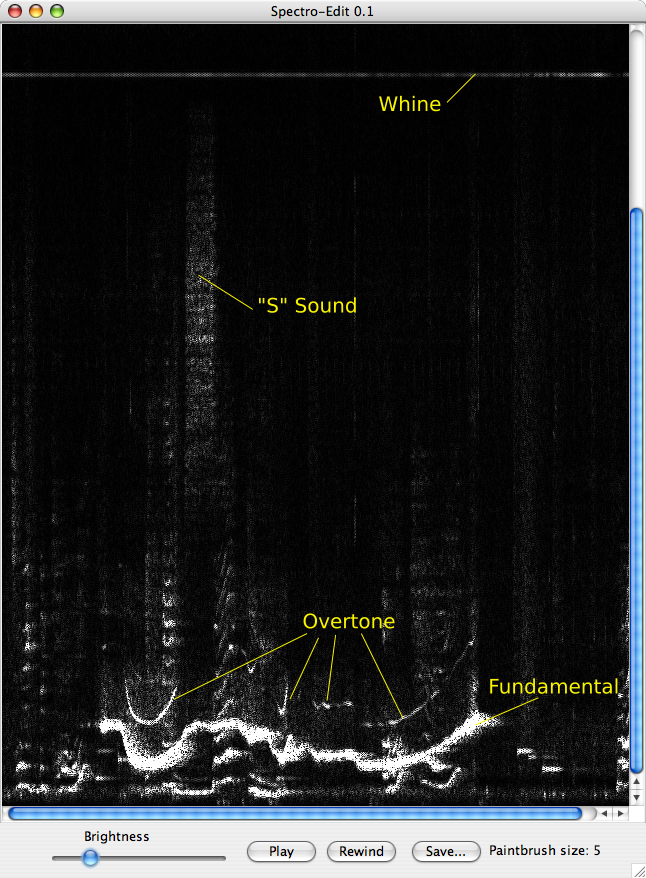

Spectro-Edit is a tool for visually manipulating audio in the frequency domain, and then listening to the effects your changes
have had. It also has an easy-to-understand API, so you can use it as a starting point for your own spectral domain audio projects.



##Building

Build the project with `ant jar`. You will need [Apache Ant](https://ant.apache.org/bindownload.cgi) (sorry, it's an old project).

The output should look like this:

```
$ ant jar
Buildfile: /Users/devfloater57/prg/spectro-edit/build.xml

compile:
    [mkdir] Created dir: /Users/devfloater57/prg/spectro-edit/build
    [javac] /Users/devfloater57/prg/spectro-edit/build.xml:22: warning: 'includeantruntime' was not set, defaulting to build.sysclasspath=last; set to false for repeatable builds
    [javac] Compiling 39 source files to /Users/devfloater57/prg/spectro-edit/build
    [javac] /Users/devfloater57/prg/spectro-edit/src/net/bluecow/spectro/action/NewProjectFromClipboardAction.java:32: warning: HexDumpEncoder is internal proprietary API and may be removed in a future release
    [javac] import sun.misc.HexDumpEncoder;
    [javac]                ^
    [javac] /Users/devfloater57/prg/spectro-edit/src/net/bluecow/spectro/action/NewProjectFromClipboardAction.java:66: warning: HexDumpEncoder is internal proprietary API and may be removed in a future release
    [javac]                     HexDumpEncoder hde = new HexDumpEncoder();
    [javac]                     ^
    [javac] /Users/devfloater57/prg/spectro-edit/src/net/bluecow/spectro/action/NewProjectFromClipboardAction.java:66: warning: HexDumpEncoder is internal proprietary API and may be removed in a future release
    [javac]                     HexDumpEncoder hde = new HexDumpEncoder();
    [javac]                                              ^
    [javac] Note: /Users/devfloater57/prg/spectro-edit/src/net/bluecow/spectro/action/NewProjectFromClipboardAction.java uses unchecked or unsafe operations.
    [javac] Note: Recompile with -Xlint:unchecked for details.
    [javac] 3 warnings
     [copy] Copying 8 files to /Users/devfloater57/prg/spectro-edit/build

jar:
    [mkdir] Created dir: /Users/devfloater57/prg/spectro-edit/dist
    [mkdir] Created dir: /Users/devfloater57/prg/spectro-edit/dist/META-INF
    [unjar] Expanding: /Users/devfloater57/prg/spectro-edit/lib/jtransforms-1.6.jar into /Users/devfloater57/prg/spectro-edit/build
     [copy] Copying 1 file to /Users/devfloater57/prg/spectro-edit/build/META-INF
     [copy] Copying 1 file to /Users/devfloater57/prg/spectro-edit/build/META-INF
      [jar] Building jar: /Users/devfloater57/prg/spectro-edit/dist/spectro-edit_0.4.jar

BUILD SUCCESSFUL
Total time: 3 seconds
```

##Startup

On Windows, Mac OS X, and most desktop Linux systems, simply double-click the `dist/spectroedit-x.y.jar` file. If that doesn't
work, try `java -jar dist/spectroedit-x.y.jar` instead.

In all cases, ensure you have a Java 8 runtime environment on your system. To check your JRE version on the command line,
execute the command java -version. If you don't have [the latest JDK from Oracle](http://www.oracle.com/technetwork/java/javase/downloads/jdk8-downloads-2133151.html)
then grab it!

**Pro Tip:** Install the Oracle JDK rather than the Oracle JRE. The Oracle JDK doesn't come bundled with crapware.

##Choosing a File

Once spectro-edit is started, you will see a file dialog. Choose any 16-bit mono WAV or AIFF file. Support for opening
stereo recordings and MP3 or Ogg files may be available in a future version of Spectro-Edit.

##Looking


What you see is a display of your audio clip with time progressing across the screen from left to right (the same as a
traditional waveform editor such as Audacity or CoolEdit), but up and down, you see the amount of signal energy at the
various frequencies--low at the bottom to high at the top.

As you move the mouse across the displayed audo clip, a continuous readout in the toolbar tells you the current pitch
(y-axis) and time (x-axis) you are pointing at.

##Listening

Press the Play button to begin playback. Presently, the playback position indicator is a bit dodgy. You'll see some
lines splay above the top of the image as playback progresses.

When playing, the play button becomes the Pause button. Playback will pause after you press this, and you can resume it
later from the same point by pressing play again.

At any time, you can reset the playback position to the beginning by pressing Rewind.

##Modifying

You can erase any part of the signal by pressing and/or dragging the mouse over the visual display. You can even make
modifications during playback, and you will hear them right away.

You can undo any change by pressing Undo. Press Undo again to undo a previous change.

##Saving Your Work

When you're happy with the way things sound, you can save it out as a 16-bit WAV file. Simply press the Save... button
and choose the save location in the dialog that pops up. Please be careful: Spectro-Edit does not currently prompt you
before overwriting an existing file.
